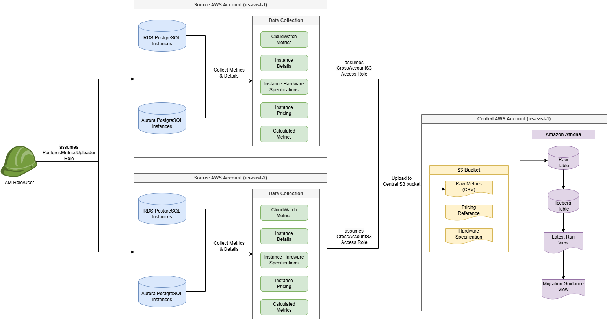

# Aurora Serverless Migration Assessment Tool

## Overview

The Aurora Serverless Migration Assessment Tool is a tool designed to help AWS customers evaluate and plan their migration to Aurora Serverless v2 from either provisioned Aurora PostgreSQL or RDS PostgreSQL databases. By analyzing workload patterns, evaluating migration suitability, and providing detailed cost implications, the tool enables organizations to make data-driven migration decisions.

### Key Features

- Cross-account and cross-region assessment capabilities
- Centralized metrics collection and analysis
- Pre-built analysis templates for common migration scenarios
- Custom analysis capabilities using Amazon Athena
- Integration with AWS pricing data for accurate cost comparisons

## High-Level Architecture



The tool consists of three main components:

1. **Data Collection Framework**
   - Collects metrics from source accounts/regions
   - Gathers instance specifications and pricing data
   - Processes CloudWatch metrics

2. **Central Repository**
   - S3-based storage for raw metrics
   - Athena tables for structured data analysis
   - Pre-built views for migration assessment

3. **Analysis Engine**
   - Workload pattern analysis
   - Cost comparison calculations
   - Migration recommendation engine

## Quick Start

### Prerequisites

- AWS account access with appropriate permissions
- Python 3.x
- AWS CLI configured with appropriate credentials

### Installation

1. Clone the repository:
```bash
git clone https://github.com/aws-samples/sample-aurora-serverless-migration-assessment-tool.git
cd sample-aurora-serverless-migration-assessment-tool
```

2. Create a virtual environment
```bash
python3 -m venv venv
source venv/bin/activate  # On Windows: venv\Scripts\activate
```

3. Install required dependencies:
```bash
pip install -r requirements.txt
```

### Basic Usage
1. Set up the central AWS account:
```bash
python3 setup/setup_central_account.py --account-id <CENTRAL_ACCOUNT_ID> --region <CENTRAL_AWS_REGION>
python3 configure_ec2_instance_profile.py --instance-id <EC2_INSTANCE_ID> --account-id <CENTRAL_ACCOUNT_ID> --region <EC2_AWS_REGION>
```

2. Set up source AWS account(s):
```bash
export AWS_REGION=<EC2_AWS_REGION>
python3 setup/setup_source_account.py --central-account-id <CENTRAL_ACCOUNT_ID>
python3 configure_ec2_instance_profile.py --instance-id <EC2_INSTANCE_ID> --account-id <SOURCE_ACCOUNT_ID> --region <EC2_AWS_REGION>
```

3. Collect metrics:
```bash
export AWS_REGION=<DBCLUSTER_AWS_REGION>
python3 src/collector/get_rds_aurora_postgres_metrics.py --cluster-identifier all --central-account-id <CENTRAL_ACCOUNT_ID>
```

4. Analyze collected data:
```bash
python3 src/analysis/populate_metrics_tables.py --central-account-id <CENTRAL_ACCOUNT_ID> --region <CENTRAL_AWS_REGION>
```

## Detailed Documentation
- [Setup Guide](docs/setup-guide.md)
- [Metrics Collection Guide](docs/metrics-collection-guide.md)
- [Metrics Analysis Guide](docs/metrics-analysis-guide.md)

## Security

See [CONTRIBUTING](CONTRIBUTING.md#security-issue-notifications) for more information.

## License

This library is licensed under the MIT-0 License. See the [LICENSE](LICENSE) file.
