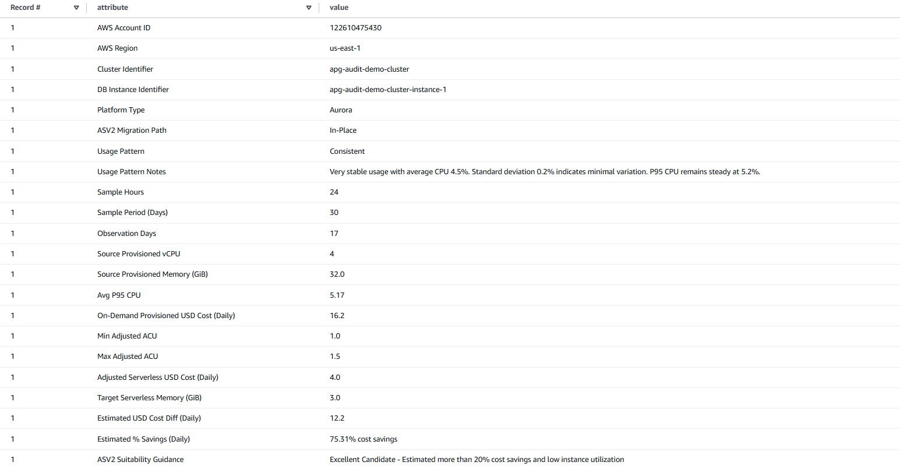

 # Metrics Analysis Guide

This guide explains how to analyze collected metrics and interpret results for Aurora Serverless v2 migration assessment.

## Analysis Overview

The tool provides comprehensive analysis of:
- Workload patterns
- Cost implications
- Migration suitability
- Capacity recommendations

## Running Analysis

### 1. Populate Analysis Tables

```bash
python3 populate_metrics_tables.py \
  --central-account-id <CENTRAL_ACCOUNT_ID> \
  --region <CENTRAL_AWS_REGION> \
```

### 2. Access Pre-built Views

```sql
SELECT * FROM asv2_migration_guidance_summary
WHERE account_id = '<ACCOUNT_ID>';
```

## Understanding Results


### Workload Patterns
1. **Peaks and Valleys**
- Regular fluctuation patterns
- Business hours correlation
- Weekend vs. weekday patterns

2. **Outliers**
- Occasional significant spikes
- Frequency of outliers

3. **Random**
- Unpredictable usage patterns
- Variability assessment

4. **Consistent**
- Stable usage patterns
- Resource utilization

### Cost Analysis
#### Calculation Methodology

1. **vCPU Utilization**

```
Effective vCPU = (P95 CPU% / 100) * Instance vCPU
```

2. **ACU Estimation**

```
ACUs = vCPU * Instance Family Ratio
```

3. **Cost Projection**

```
Hourly Cost = ACUs * ACU Price/Hour
```

### Custom Analysis
#### Using Athena Queries

**Creating Custom Views**
```
CREATE VIEW custom_analysis AS
SELECT ...
```

## Best Practices
1. **Analysis Preparation**
- Verify data completeness
- Consider business context
- Include all relevant metrics

2. **Interpretation Guidelines**
- Consider multiple factors
- Account for growth
- Factor in seasonality

3. **Decision Making**
- Document assumptions
- Include stakeholder input
- Plan for validation

## Next Steps

After analysis:
1. Review recommendations
2. Create migration strategy
3. Plan pilot migrations
4. Establish success metrics